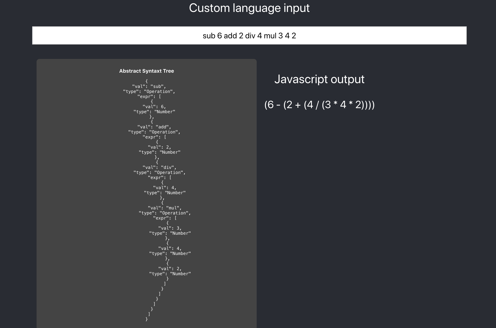

## Custom prefix language to javascript interpreter with frontend app

### How to run

In order to run the project, [node.js](https://nodejs.org/en/) must be installed.

- Run `yarn install` to install all dependencies
- Run `yarn start` to run project locally in the browser (localhost:3000)


Thanks to the web page, you can provide your own input. it will dynamically respond with interpreted Javascript expressions as well as Abstract Syntax Tree.

### Grammar

Grammar for this simple prefix language, according to [EBNF syntax](https://en.wikipedia.org/wiki/Extended_Backus%E2%80%93Naur_form), will look like this:

```
digit = 0 | 1 | 2 | 3 | 4 | 5 | 6 | 7 | 8 | 9
num = digit+
op = add | sub | mul | div
expr = num | op expr+
```

It is a simple language that allows basic arithmetic operations on `0-9` digits that can be composed into bigger numbers.

### Node Types

##### `/src/interpreter/nodeTypes.js`

```js
export const Op = "Operation";
export const Num = "Number";
```

There are two node types defined: `Operation` and `Number`. Those will be present later on in Abstract Syntax Tree.

### Lexical Analyzer (Lexer)

##### `/src/interpreter/lexer.js`

```js
export const lex = (expr) =>
  expr
    .split(" ")
    .map((word) => word.trim())
    .filter((word) => word.length);
```

The purpose of lexical analyzer is to divide the expressions into small chunks called tokens. Each token has a label that provides lexical explanation of it.
For the example `add 5 3`, lexer's output will be:

```js
["add", "3", "5"];
```

### Parser

##### `/src/interpreter/parser.js`

```js
import { Op, Num } from "./nodeTypes";

export const parse = (tokens) => {
  let char = 0;

  const peek = () => tokens[char];
  const consume = () => tokens[char++];

  const parseNumber = () => ({ val: parseInt(consume()), type: Num });

  const parseOperator = () => {
    const node = { val: consume(), type: Op, expr: [] };
    while (peek()) node.expr.push(parseExpr());
    return node;
  };

  const parseExpr = () => (/\d/.test(peek()) ? parseNumber() : parseOperator());
  return parseExpr();
};
```

Parser will create an `Abstract Syntax Tree` out of the tokens.

For the output from lexical analyzer:

```js
["add", "3", "5"];
```
It'll parse each token individually, checking with the regular expression whether it's a `Number` or `Operation`:
```js
(/\d/.test(peek()) ? parseNumber() : parseOperator());
```

Parser will create the following tree structure:

```json
{
  "val": "add",
  "type": "Operation",
  "expr": [
    {
      "val": 5,
      "type": "Number"
    },
    {
      "val": 3,
      "type": "Number"
    }
  ]
}
```

### Transpiler

##### `/src/interpreter/transpiler.js`

```js
import { Op, Num } from "./nodeTypes";

export const transpile = (ast) => {
  const opMap = { add: "+", mul: "*", sub: "-", div: "/" };
  const transpileNode = (ast) =>
    ast.type === Num ? transpileNum(ast) : transpileOp(ast);
  const transpileNum = (ast) => ast.val;
  const transpileOp = (ast) =>
    `(${ast.expr.map(transpileNode).join(" " + opMap[ast.val] + " ")})`;
  return transpileNode(ast);
};
```

Transpiler is a function that will convert the `AST` produced by the parser to javascript code using mappers for all specified operations:

```js
const opMap = { add: "+", mul: "*", sub: "-", div: "/" };
```

For the previously defined `AST`:

```json
{
  "val": "add",
  "type": "Operation",
  "expr": [
    {
      "val": 5,
      "type": "Number"
    },
    {
      "val": 3,
      "type": "Number"
    }
  ]
}
```

it'll produce:

```js
5 + 3
```